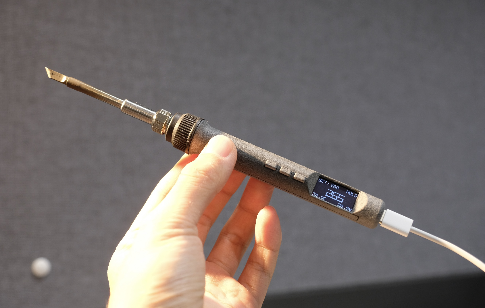

# T12-PD-SolderingPen

使用atmega328p作为主控芯片，128x64 OLED屏幕，内置陀螺仪和蜂鸣器。能够读取控制部分电路温度和输入电压，主控电压，主控温度。具备自动启停的功能。

可以保存多组不同的烙铁头信息。烙铁主控部分代码基于<https://github.com/wagiminator/ATmega-Soldering-Station>.在屏幕驱动、按键驱动、休眠检测、陀螺仪和内部温度检测等方面做出调整与改进。

## 制作信息

- 手柄部分请使用1.6mm双层板打样，主控部分请使用0.8mm四层板。

- 屏幕较为特殊，为0.96寸64x128分辨率sh1107驱动OLED屏幕，0.3mm脚距插接13pin接口。

- FS312协议芯片请使用H版，以支持20v电压。

- 建议开一张钢片用锡膏焊接，大大降低难度。

- 焊接完成之后需要飞线到预留的焊盘，进行程序烧录。

详细信息稍后更新。
